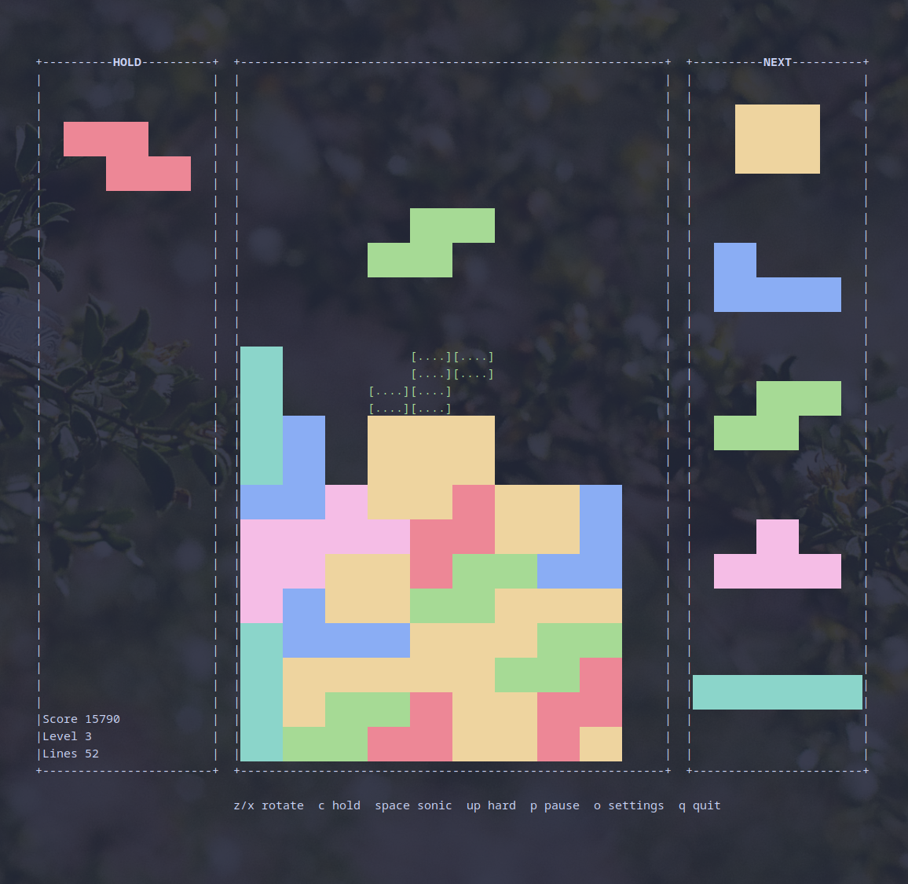

# terminalpolyominos

A lightweight polyomino stacking game for Unix terminals. Written in C++20 with
CMake, **GPL-3.0-or-later**, and **no third-party libraries** — just the C++
standard library and POSIX termios. The AppImage is about **1 MB**.

Binary: **`terminalpolyominos`** · short name: **`tpoly`**



Run it **inside a terminal** (real TTY required). It scales the playfield to your
window, keeps redraws low-flicker, and aims for snappy input without busy-spinning
the CPU.

**Gameplay highlights**

- Hold, ghost piece, lock delay, soft / hard / sonic drop
- Remappable keys and timing via an in-game settings menu (`o`)
- Randomizers: 7-bag (default), 7+1 bag, or full random
- NEXT queue length 1–5; line-clear and hard-drop flash polish
- ANSI color when available (`NO_COLOR` / `TERM=dumb` respected)
- Config under `~/.config/tpoly/.tpolyrc` (XDG)

---

## Play — download and run

1. Grab the AppImage for your CPU from
   **[Releases](https://github.com/Garrett-Webb/terminalpolyominos/releases/latest)**
   (`x86_64` or `aarch64`).
2. Make it executable and launch:

```bash
chmod +x terminalpolyominos-*-$(uname -m).AppImage
./terminalpolyominos-*-$(uname -m).AppImage
```

### Controls (defaults)

| Key | Action |
|---|---|
| Enter / r | Start / restart |
| o | Settings |
| ←→↓ / a d s / h l j | Move / soft drop |
| ↑ | Hard drop (locks) |
| Space | Sonic drop (no lock) |
| w k x | Rotate CW |
| z | Rotate CCW |
| c | Hold |
| p / Esc | Pause |
| q | Quit (title / pause / game over) |

Settings and keybinds are editable in-game (`o`) and saved to `~/.config/tpoly/.tpolyrc`.  
Set `NO_COLOR=1` or use `TERM=dumb` to disable color.

---

## Develop — build and modify

### Requirements

- C++20 compiler (g++ or clang++)
- CMake ≥ 3.20
- Unix / Linux TTY

### Build & run

```bash
cmake -S . -B build -DCMAKE_BUILD_TYPE=Release
cmake --build build -j
./build/terminalpolyominos
```

### Tests

```bash
ctest --test-dir build --output-on-failure
# or: ./build/tp_tests
```

### Install (optional)

```bash
cmake --install build --prefix ~/.local
# installs terminalpolyominos and a tpoly symlink into ~/.local/bin
```

### Layout

| Path | Role |
|---|---|
| `src/game/` | Pure engine (`tp_game`) — no terminal I/O |
| `src/app/` | Main loop, screens, settings menu |
| `src/terminal/` | Raw TTY, ANSI, key decode |
| `src/input/` | Keybinds → actions |
| `src/render/` | Layout + diff canvas |
| `src/util/` | XDG paths, `.tpolyrc` |
| `tests/` | Engine / input / settings tests |
| `packaging/appimage/` | AppImage build script + metadata |

### Config file

```text
~/.config/tpoly/.tpolyrc
```

(`$XDG_CONFIG_HOME/tpoly/.tpolyrc` if set.) Legacy `~/.tpolyrc` is read if the XDG file is missing.

Timing keys: `move_interval_ms`, `soft_drop_interval_ms`, `release_ms`, `lock_delay_ms`, `lines_per_level`, `next_count` (1–5), `randomizer` (`7bag`, `7+1`, `random`).

Keybind keys (comma-separated tokens, e.g. `left,a,h`): `key_left`, `key_right`, `key_soft_drop`, `key_hard_drop`, `key_sonic_drop`, `key_rotate_cw`, `key_rotate_ccw`, `key_hold`, `key_pause`, `key_quit`, `key_restart`, `key_settings`.

---

## License

[GPL-3.0-or-later](LICENSE) — modifications you distribute must stay open source under the same license.
